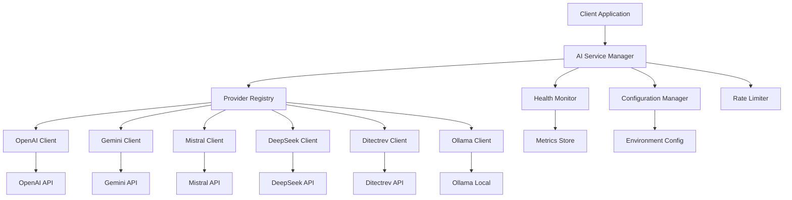

# Design Document

## Overview

The API integrations feature will enhance the existing AI provider system by implementing robust, production-ready integrations with multiple AI services. The design builds upon the current provider abstraction layer while adding comprehensive error handling, failover mechanisms, rate limiting, and monitoring capabilities.

The system will maintain the existing `AIProvider` interface while extending it with additional capabilities for configuration management, health monitoring, and advanced error recovery. This ensures backward compatibility while providing the reliability needed for production use.

## Architecture

### High-Level Architecture



### Core Components

1. **AI Service Manager**: Central orchestrator that manages provider selection, failover, and request routing
2. **Configuration Manager**: Handles provider configurations, API keys, and runtime settings
3. **Provider Registry**: Maintains available providers and their health status
4. **Health Monitor**: Continuously monitors provider availability and performance
5. **Rate Limiter**: Manages request throttling and quota enforcement
6. **Enhanced Provider Clients**: Improved implementations with retry logic and error handling

## Components and Interfaces

### Enhanced AIProvider Interface

```typescript
interface AIProvider {
  name: string;
  isAvailable(): Promise<boolean>;
  getHealthStatus(): ProviderHealthStatus;
  generateExplanation(request: ExplanationRequest): Promise<ExplanationResponse>;
  validateConfiguration(): boolean;
}

interface ExplanationRequest {
  question: string;
  correctAnswers: string[];
  apiKey?: string;
  options?: RequestOptions;
}

interface ExplanationResponse {
  explanation: string;
  provider: string;
  metadata: ResponseMetadata;
}

interface ProviderHealthStatus {
  isHealthy: boolean;
  lastChecked: Date;
  responseTime: number;
  errorRate: number;
  rateLimitStatus: RateLimitInfo;
}
```

### Configuration Management

```typescript
interface ProviderConfig {
  name: string;
  enabled: boolean;
  priority: number;
  apiKey?: string;
  baseUrl?: string;
  timeout: number;
  retryAttempts: number;
  rateLimits: RateLimitConfig;
}

interface RateLimitConfig {
  requestsPerMinute: number;
  requestsPerHour: number;
  requestsPerDay: number;
  burstLimit: number;
}
```

### AI Service Manager

The central service manager will implement intelligent provider selection and failover:

```typescript
class AIServiceManager {
  private providers: Map<string, AIProvider>;
  private healthMonitor: HealthMonitor;
  private rateLimiter: RateLimiter;
  private configManager: ConfigurationManager;

  async generateExplanation(request: ExplanationRequest): Promise<ExplanationResponse> {
    const availableProviders = await this.getAvailableProviders();
    
    for (const provider of availableProviders) {
      try {
        if (await this.rateLimiter.canMakeRequest(provider.name)) {
          const response = await provider.generateExplanation(request);
          await this.recordSuccess(provider.name);
          return response;
        }
      } catch (error) {
        await this.recordFailure(provider.name, error);
        continue; // Try next provider
      }
    }
    
    throw new Error('All providers unavailable');
  }
}
```

## Data Models

### Request/Response Models

```typescript
interface StandardizedRequest {
  question: string;
  correctAnswers: string[];
  context?: string;
  maxTokens?: number;
  temperature?: number;
  timeout?: number;
}

interface StandardizedResponse {
  explanation: string;
  provider: string;
  processingTime: number;
  tokensUsed?: number;
  confidence?: number;
  metadata: {
    requestId: string;
    timestamp: Date;
    model?: string;
    version?: string;
  };
}
```

### Provider-Specific Adapters

Each provider will have an adapter that translates between the standardized format and provider-specific APIs:

```typescript
abstract class BaseProviderAdapter implements AIProvider {
  protected config: ProviderConfig;
  protected httpClient: HttpClient;
  
  abstract transformRequest(request: StandardizedRequest): any;
  abstract transformResponse(response: any): StandardizedResponse;
  abstract validateApiKey(apiKey: string): boolean;
}
```

## Error Handling

### Error Classification

```typescript
enum ErrorType {
  AUTHENTICATION = 'authentication',
  RATE_LIMIT = 'rate_limit',
  NETWORK = 'network',
  VALIDATION = 'validation',
  PROVIDER_ERROR = 'provider_error',
  TIMEOUT = 'timeout'
}

interface APIError {
  type: ErrorType;
  message: string;
  provider: string;
  retryable: boolean;
  retryAfter?: number;
  originalError?: any;
}
```

### Retry Strategy

```typescript
class RetryStrategy {
  async executeWithRetry<T>(
    operation: () => Promise<T>,
    config: RetryConfig
  ): Promise<T> {
    let lastError: Error;
    
    for (let attempt = 1; attempt <= config.maxAttempts; attempt++) {
      try {
        return await operation();
      } catch (error) {
        lastError = error;
        
        if (!this.isRetryable(error) || attempt === config.maxAttempts) {
          throw error;
        }
        
        const delay = this.calculateBackoff(attempt, config);
        await this.sleep(delay);
      }
    }
    
    throw lastError;
  }
}
```

### Circuit Breaker Pattern

```typescript
class CircuitBreaker {
  private state: 'CLOSED' | 'OPEN' | 'HALF_OPEN' = 'CLOSED';
  private failureCount = 0;
  private lastFailureTime?: Date;
  
  async execute<T>(operation: () => Promise<T>): Promise<T> {
    if (this.state === 'OPEN') {
      if (this.shouldAttemptReset()) {
        this.state = 'HALF_OPEN';
      } else {
        throw new Error('Circuit breaker is OPEN');
      }
    }
    
    try {
      const result = await operation();
      this.onSuccess();
      return result;
    } catch (error) {
      this.onFailure();
      throw error;
    }
  }
}
```

## Testing Strategy

### Integration Testing Framework

```typescript
interface ProviderTestSuite {
  testConnectivity(): Promise<TestResult>;
  testAuthentication(): Promise<TestResult>;
  testRequestResponse(): Promise<TestResult>;
  testErrorHandling(): Promise<TestResult>;
  testRateLimiting(): Promise<TestResult>;
}

class AIProviderTester {
  async runFullTestSuite(provider: AIProvider): Promise<TestReport> {
    const results = await Promise.all([
      this.testBasicFunctionality(provider),
      this.testErrorScenarios(provider),
      this.testPerformance(provider)
    ]);
    
    return this.generateReport(results);
  }
}
```

### Mock Provider for Testing

```typescript
class MockAIProvider implements AIProvider {
  private shouldFail = false;
  private responseDelay = 0;
  
  async generateExplanation(request: ExplanationRequest): Promise<ExplanationResponse> {
    if (this.shouldFail) {
      throw new Error('Mock provider failure');
    }
    
    await this.sleep(this.responseDelay);
    
    return {
      explanation: `Mock explanation for: ${request.question}`,
      provider: 'mock',
      metadata: {
        requestId: 'mock-' + Date.now(),
        timestamp: new Date(),
        processingTime: this.responseDelay
      }
    };
  }
}
```

### Performance Monitoring

```typescript
interface PerformanceMetrics {
  averageResponseTime: number;
  successRate: number;
  errorRate: number;
  throughput: number;
  p95ResponseTime: number;
  p99ResponseTime: number;
}

class MetricsCollector {
  async recordRequest(provider: string, duration: number, success: boolean): Promise<void> {
    // Record metrics for monitoring and alerting
  }
  
  async getProviderMetrics(provider: string, timeRange: TimeRange): Promise<PerformanceMetrics> {
    // Retrieve aggregated metrics
  }
}
```

## Security Considerations

### API Key Management

- API keys stored securely in environment variables
- Key rotation support with graceful fallback
- Validation of key formats before use
- Audit logging of key usage

### Request Validation

- Input sanitization for all user-provided content
- Request size limits to prevent abuse
- Rate limiting per user/IP to prevent DoS
- Response content filtering for safety

### Data Privacy

- No storage of user questions or AI responses
- Minimal logging of request metadata
- Compliance with data protection regulations
- Secure transmission of all API communications

## Deployment and Configuration

### Environment Configuration

```typescript
interface DeploymentConfig {
  providers: {
    [key: string]: ProviderConfig;
  };
  rateLimits: GlobalRateLimits;
  monitoring: MonitoringConfig;
  security: SecurityConfig;
}
```

### Health Checks

- Endpoint for overall system health
- Individual provider health status
- Dependency health monitoring
- Automated alerting on failures

This design provides a robust, scalable foundation for API integrations while maintaining the simplicity of the existing interface. The modular architecture allows for easy addition of new providers and features while ensuring reliability and performance.