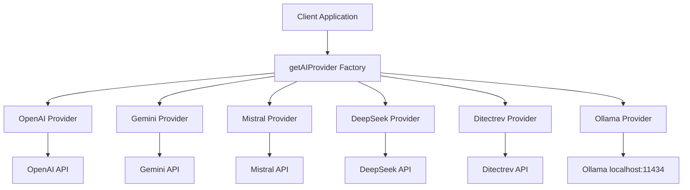

# Design Document

## Overview

The API integrations feature will enhance the existing AI provider system by replacing proxy API routes with direct calls to external AI services. The design maintains the current simple architecture while adding basic validation, error handling, and availability checking.

The system will keep the existing `AIProvider` interface unchanged for backward compatibility while adding optional methods for validation and availability checking. This ensures existing code continues to work while providing better error handling.

## Architecture

### High-Level Architecture



### Core Components

1. **AIProvider Interface**: Simple interface with generateExplanation method
2. **Provider Classes**: Individual classes for each AI service with direct API calls
3. **Factory Function**: getAIProvider function to instantiate providers by name
4. **Availability Checker**: Simple function to check if providers are reachable
5. **Error Handling**: Basic AIProviderError class for consistent error reporting

## Components and Interfaces

### Enhanced AIProvider Interface

```typescript
interface AIProvider {
  name: string;
  generateExplanation(
    question: string,
    correctAnswers: string[],
    apiKey?: string,
  ): Promise<string>;
  isAvailable?(): Promise<boolean>;
  validateConfig?(apiKey?: string): boolean;
}

class AIProviderError extends Error {
  constructor(
    public provider: string,
    public type: 'network' | 'auth' | 'rate_limit' | 'validation' | 'timeout',
    message: string,
    public originalError?: any
  ) {
    super(message);
    this.name = 'AIProviderError';
  }
}
```

### Provider Implementation Pattern

Each provider follows this simple pattern:

```typescript
export class ExampleProvider implements AIProvider {
  name = "example";

  async generateExplanation(
    question: string,
    correctAnswers: string[],
    apiKey: string,
  ): Promise<string> {
    this.validateRequest(question, correctAnswers, apiKey);

    try {
      const response = await fetch("https://api.example.com/chat", {
        method: "POST",
        headers: { 
          "Content-Type": "application/json",
          "Authorization": `Bearer ${apiKey}`
        },
        body: JSON.stringify({
          prompt: `${question} Explain why these answers are correct: ${correctAnswers.join(", ")}`,
        }),
      });

      if (!response.ok) {
        const errorType = response.status === 401 ? 'auth' : 
                         response.status === 429 ? 'rate_limit' : 'network';
        throw new AIProviderError(this.name, errorType, `API error: ${response.status}`);
      }

      const data = await response.json();
      return data.explanation || data.choices?.[0]?.message?.content;
    } catch (error) {
      if (error instanceof AIProviderError) throw error;
      const errorMessage = error instanceof Error ? error.message : 'Unknown error';
      throw new AIProviderError(this.name, 'network', `Request failed: ${errorMessage}`, error);
    }
  }

  async isAvailable(): Promise<boolean> {
    return true; // API-based providers are assumed available
  }

  validateConfig(apiKey?: string): boolean {
    return !!(apiKey && apiKey.length > 10);
  }

  private validateRequest(question: string, correctAnswers: string[], apiKey: string): void {
    if (!question?.trim()) {
      throw new AIProviderError(this.name, 'validation', 'Question cannot be empty');
    }
    if (!correctAnswers?.length) {
      throw new AIProviderError(this.name, 'validation', 'At least one correct answer is required');
    }
    if (!this.validateConfig(apiKey)) {
      throw new AIProviderError(this.name, 'auth', 'Invalid API key');
    }
  }
}
```

### Factory Function

The existing factory function remains unchanged:

```typescript
export function getAIProvider(providerName: string): AIProvider {
  switch (providerName) {
    case "ollama":
      return new OllamaProvider();
    case "openai":
      return new OpenAIProvider();
    case "gemini":
      return new GeminiProvider();
    case "mistral":
      return new MistralProvider();
    case "deepseek":
      return new DeepSeekProvider();
    case "ditectrev":
      return new DitectrevProvider();
    default:
      throw new Error(`Unknown AI provider: ${providerName}`);
  }
}
```

### Availability Checking

Simple availability checking function:

```typescript
export async function checkProviderAvailability(
  providerName: string,
  apiKey?: string,
): Promise<boolean> {
  try {
    const provider = getAIProvider(providerName);
    
    // Check config validation if provider supports it
    if (provider.validateConfig && !provider.validateConfig(apiKey)) {
      return false;
    }
    
    // Check availability if provider supports it
    if (provider.isAvailable) {
      return await provider.isAvailable();
    }
    
    return true;
  } catch {
    return false;
  }
}
```

## Error Handling

### Simple Error Classification

```typescript
class AIProviderError extends Error {
  constructor(
    public provider: string,
    public type: 'network' | 'auth' | 'rate_limit' | 'validation' | 'timeout',
    message: string,
    public originalError?: any
  ) {
    super(message);
    this.name = 'AIProviderError';
  }
}
```

### Optional Retry Utility

Simple retry function for cases where it's needed:

```typescript
export async function withRetry<T>(
  operation: () => Promise<T>,
  maxAttempts: number = 3,
  delay: number = 1000
): Promise<T> {
  let lastError: Error;
  
  for (let attempt = 1; attempt <= maxAttempts; attempt++) {
    try {
      return await operation();
    } catch (error) {
      lastError = error as Error;
      
      // Don't retry on validation or auth errors
      if (error instanceof AIProviderError && 
          (error.type === 'validation' || error.type === 'auth')) {
        throw error;
      }
      
      if (attempt === maxAttempts) {
        throw error;
      }
      
      // Wait before retry
      await new Promise(resolve => setTimeout(resolve, delay * attempt));
    }
  }
  
  throw lastError!;
}
```

## Implementation Approach

### Direct API Integration

Each provider will make direct calls to the respective AI service APIs:

- **OpenAI**: Direct calls to `https://api.openai.com/v1/chat/completions`
- **Gemini**: Direct calls to Google's Gemini API
- **Mistral**: Direct calls to Mistral's API endpoints  
- **DeepSeek**: Direct calls to DeepSeek's API endpoints
- **Ollama**: Continue calling `http://localhost:11434/api/generate`
- **Ditectrev**: Keep existing internal API calls

### Backward Compatibility

The enhanced system maintains full backward compatibility:

- Existing `AIProvider` interface unchanged
- Factory function `getAIProvider()` continues to work
- Availability checker `checkProviderAvailability()` enhanced but compatible
- All existing code continues to work without modifications

### Simple Validation

Basic validation for common issues:

- Empty questions or answers
- Invalid API key formats (basic checks)
- Network connectivity for Ollama
- Response validation (ensure explanation is returned)

This design keeps the system simple and maintainable while adding the essential enhancements needed for direct API integration.